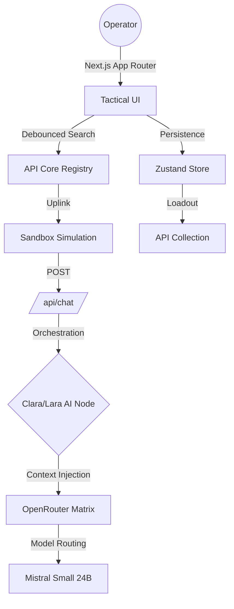
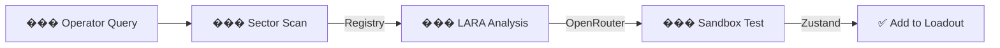

Official X Account: https://x.com/Laraagentt

Official Website: https://www.laramultiapiagent.site/

Contract Address: GUq1ddbq4LqXkzfbRbztoSD2P7NvpVF9ppxiopkHpump

<p align="center">
  
</p>

<h1 align="center">LaraMultiApiAgent</h1>

<p align="center">
  <strong>The Tactical Multi-API Orchestration Layer for Autonomous Intelligence</strong>
</p>

<p align="center">
  <a href="https://nextjs.org/"></a>
  <a href="https://www.typescriptlang.org/"></a>
  <a href="https://pnpm.io/"></a>
  <a href="https://tailwindcss.com/"></a>
</p>

---

## ⚡ The Logic of LARA

When the age of autonomous agents began, it was chaotic. APIs were scattered, documentation was inconsistent, and integration required painstaking manual labor. Systems were rigid, built for single tasks, and lacked the fluidity to adapt to the rapidly evolving digital landscape. The web became a jungle of disconnected endpoints.

**LARA was born from a different question: What if intelligence could seamlessly traverse any API architecture?**

LaraMultiApiAgent is not just a catalog; it is a **Tactical Orchestration Engine** designed to bridge the gap between thousands of public APIs and actionable AI intelligence. While others focus on static documentation, LARA focuses on dynamic simulation, testing, and intelligent routing.

---

## Modular Architecture

LaraMultiApiAgent is built with a decoupled architecture to ensure high availability and low latency.



### Tactical Synchronization
- **Sandbox Simulation**: Test API logic within a secure, AI-guided environment.
- **Clara Search Advisor**: A specialized AI node that recommends technical sectors based on operator intent.
- **Loadout Management**: Collect and export tactical API suites (JSON-ready).

---

## Core Technical Stack

| Layer | Technology | Implementation Detail |
|----------|----------------------|-----------------------|
| **Frontend** | Next.js 15 (App Router) | React Server Components & Optimized Client Interactivity |
| **Styling** | Tailwind CSS + Framer Motion | Cyberpunk CCTV HUD interface with 60fps animations |
| **AI Engine** | OpenRouter (Mistral 24B) | Multi-modal reasoning for API simulation and advice |
| **State Management** | Zustand | Persistent local storage for API "Loadouts" |
| **Performance** | use-debounce | Zero-lag filtering for high-density API registries |
| **Package Manager** | pnpm 10 | Deterministic and high-speed dependency resolution |

---

## Intelligence Engine (Neural Pipeline)

LaraMultiApiAgent employs a **Dual-Node Verification Pipeline**:

1.  **LARA Node (Sandbox)**: Focused on technical implementation, code examples, and endpoint simulation.
2.  **CLARA Node (Advisor)**: Focused on discovery, sector analysis, and strategic API mapping.
3.  **Synthesis**: Synchronizes local `apis.json` data with AI context to provide hyper-accurate technical guidance.

---

## Deployment & Engineering

### Prerequisites
- **Node.js** ^18.x
- **pnpm** ^10.x

### Environment Configuration
Create a `.env.local` file with your neural parameters:
```env
# OpenRouter Configuration
OPENROUTER_API_KEY=your_openrouter_api_key
```

### System Initialization
```bash
# Install tactical dependencies
pnpm install

# Initialize development uplink
pnpm dev

# Build production artifacts
pnpm build
```

---

## Performance Benchmarks

- **Search Latency**: < 5ms via debounced local filtering.
- **UI Responsiveness**: 0ms Layout Shift (CLS) via fixed-aspect tactical containers.
- **Asset Weight**: Optimized SVG-first iconography for instant hydration.

---

## Security & Ethics

LARA is engineered as a **Technical Guardrail**. It is programmed to identify secure endpoints (HTTPS, CORS clearance) and prioritize reliability over obscure, high-risk services. It is an operative that serves before it executes—calm in the digital storm.

---

## Community

Join the development of the next-gen API intelligence layer.

[MIT License](./LICENSE) | Created by **decimasudo**



---

## Folder Structure

```
api-forge/
├── src/
│   ├── app/              # Tactical Pages (Base, Catalog, Share)
│   ├── components/       # HUD Widgets (Header, InteractiveBG, APICard)
│   ├── lib/              # Core Logic (AI Routes, Zustand Store)
│   └── app/api/          # Neural Uplink endpoints
├── data/                 # API Registry (apis.json)
└── public/               # Tactical Assets & Metadata
```
